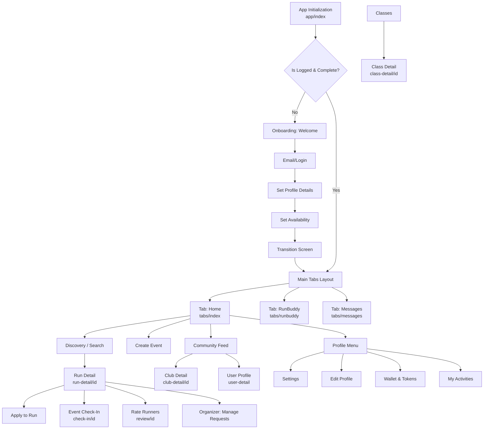
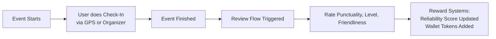

# LoccoLight - App Flows

Questo documento descrive visivamente i flussi implementati nell'app LoccoLight, divisi tra **User Flow (Navigazione)** e **Logic Flow (Logiche di Business e State Management)**.

## 1. User Flow (Navigazione delle Schermate)

Rappresenta il percorso visivo che l'utente può intraprendere navigando tra i file nella cartella `app/`.



---

## 2. Logic & System Workflow (State Management)

Rappresenta le logiche interne di sistema gestite dagli Store (es. `userStore`, `applicationStore`, `runBuddyStore`, `walletStore`).

### A. Core Application & Premium Logic (`applicationStore`)

Definisce come vengono processate le iscrizioni agli eventi in base allo status dell'utente.

```mermaid
flowchart TD
    Apply[User requests to join an Event] --> TypeCheck{Is Request 'Standard' \n or 'Instant' (Locco-Match)?}
    
    %% Standard Request
    TypeCheck -->|Standard| PremiumCheck{Is User Premium?}
    PremiumCheck -->|Yes| AutoApprove[Auto-Approved \n success: true]
    PremiumCheck -->|No| FreeCheck{Has Active Apps < 1?}
    FreeCheck -->|No| AppReject[Reject: Max 1 active booking for Free Tier]
    FreeCheck -->|Yes| PendingApp[Status: Pending Approval from Organizer]
    
    %% Instant Match (Locco Token)
    TypeCheck -->|Instant / Locco-Match| TokenCheck{Wallet Balance >= 1?}
    TokenCheck -->|No| TokenReject[Reject: Insufficient Locco Tokens]
    TokenCheck -->|Yes| DeductToken[Deduct 1 Token from Wallet]
    DeductToken --> AutoApprove

    %% Organizer Removal Logic
    Cancel[Organizer tries to remove Participant] --> TimeCheck{Hours until event < 3?}
    TimeCheck -->|Yes| BlockCancel[Reject: Cannot remove < 3h before start]
    TimeCheck -->|No| ConfCancel[Participant Removed]
```

### B. RunBuddy Matching Logic (`runBuddyStore`)

Definisce la logica dello swipe e dello sblocco chat basata sulla dimensione del gruppo bersaglio.

```mermaid
flowchart TD
    StartSwipe[User views RunBuddy Profile] --> SwipeAction{Swipe Left or Right?}
    
    SwipeAction -->|Left (Skip)| NextProfile[Show Next Candidate]
    
    SwipeAction -->|Right (Like)| LimitCheck{Has Swipe Quota? \n Max 5/day Free}
    LimitCheck -->|No| BlockSwipe[Prompt Premium Upgrade]
    LimitCheck -->|Yes| DeductSwipe[Register Swipe]

    DeductSwipe --> MatchAlgo{Algorithm Match? \n e.g., 50% chance mock}
    MatchAlgo -->|No Match| NextProfile
    MatchAlgo -->|Match| AddMatch[Add to Temp Matches Pool]
    
    AddMatch --> GroupCheck{Temp Matches >= \n targetGroupSize? \n Default: 3}
    GroupCheck -->|No| AwaitGroup[Wait for more matches]
    GroupCheck -->|Yes| UnlockChat[Unlock Group Chat for all matched buddies]
```

### C. Check-In & Game Economy

Gestisce cosa succede quando si completa e si valuta un'attività.



